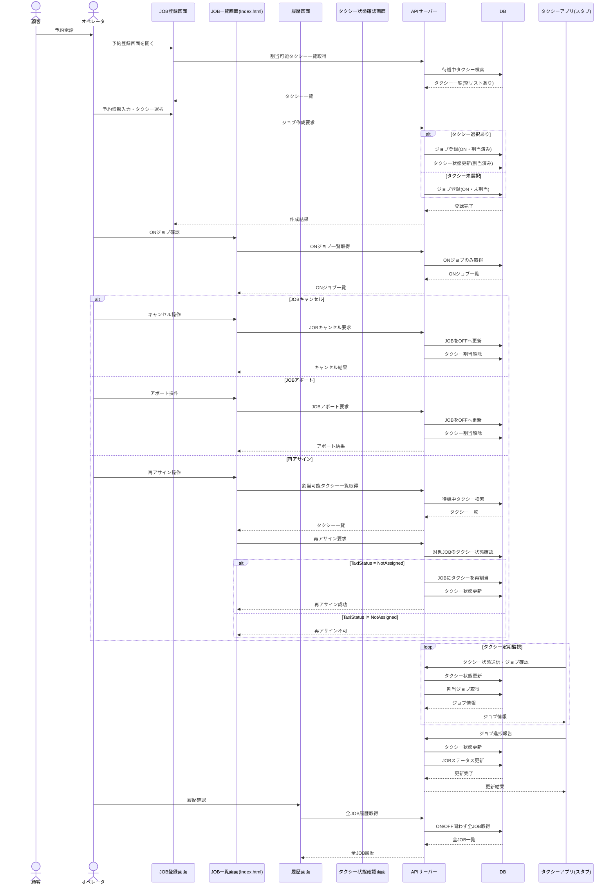
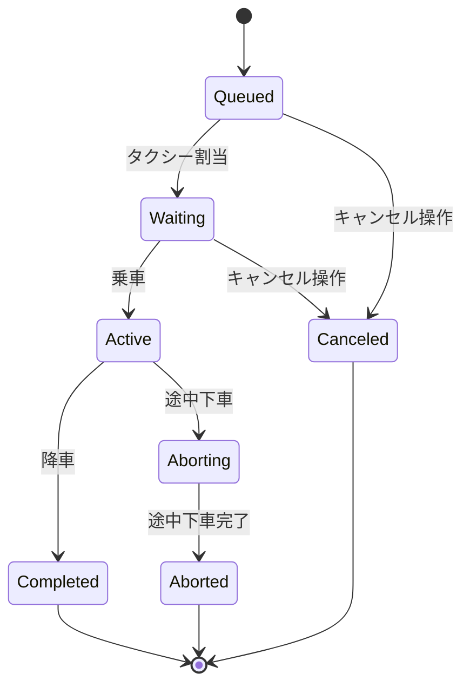
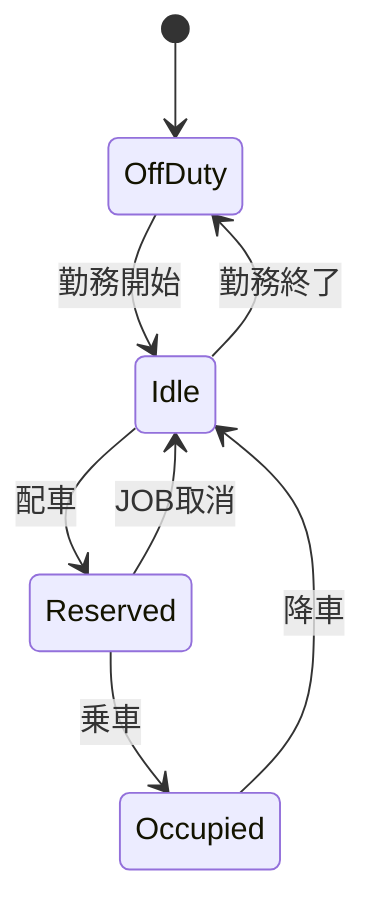

# ペアプログラミング2 : チーム4

## 課題テーマ

【バッググラウンド】

 タクシーを４，５台運用する小規模タクシー会社を想定した、タクシーの運行管理システム（TMS:Taxi Management System）を開発する。まず、配車センターのオペレーターは顧客からの予約電話を受けて、それを画面上に登録する（以後、JOB）。
 オペレータは手動でJOBを登録し、Idle状態のタクシーを割り当てることができる。割当可能なタクシーがなければ、JOB作成のみを行い、キューイングする。
 タクシーは、定点でこれを監視し、自分に割り当てられたジョブを実行し、都度進捗を報告する。

【機能と役割】
1. オペレータ画面：フロントエンド（Java Script）
  - 電話から受けた予約情報を登録する
  - タクシーを手配する
  - ジョブの進捗の管理、履歴を確認できる
  - タクシーの現在状態を確認できる
2. APIサーバー：バックエンド（ASP.NET Web API）
  - オペレータ画面からに応答する
  - タクシーアプリに応答する
  - 各種状態をDBで管理する
3. タクシーアプリ：スタブ（C#コンソール）
  - 自身の状態を切り替え、自身の現在状態をAPIサーバーに送信する
  - APIサーバーから受け取ったジョブ情報を表示する

【担当者】
- ディネス : フロントエンド、ワイヤーフレーム
- 越智孝 : バックエンド、スタブ、データ・API定義

## シーケンス図

## 状態遷移図

【JOB状態】

【タクシー状態】

### テーブル定義

### 
